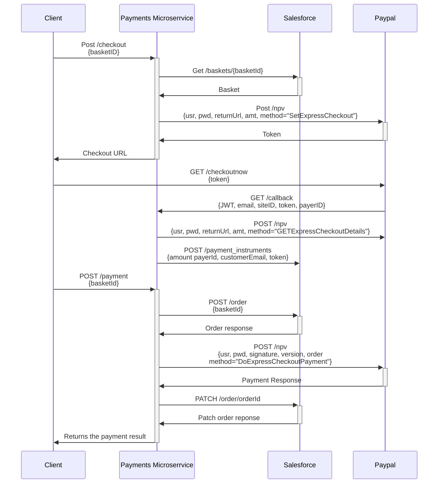
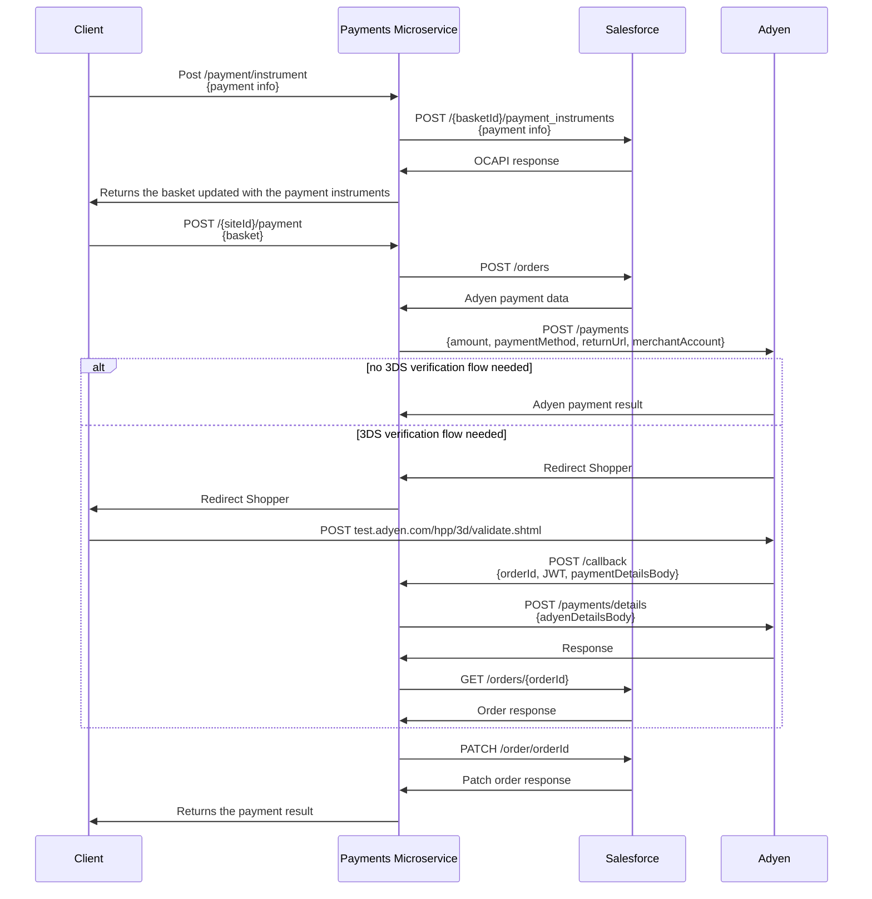
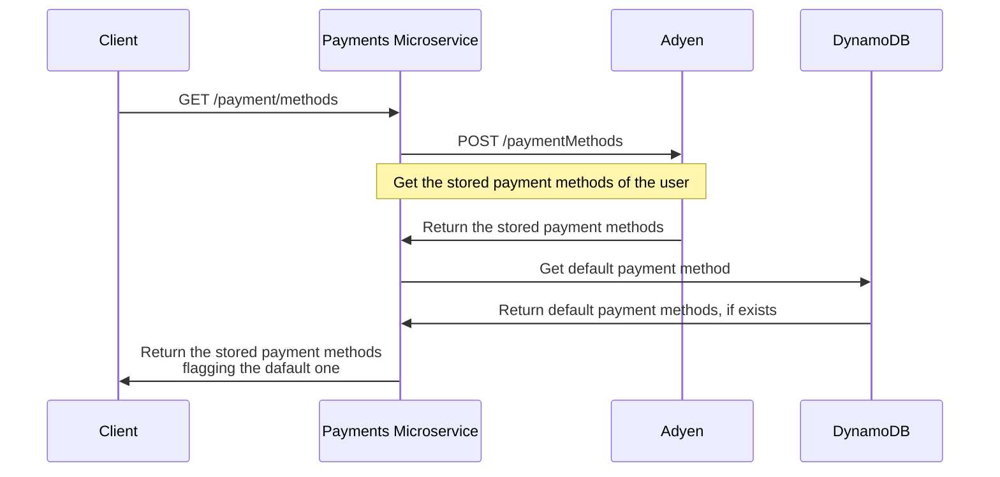
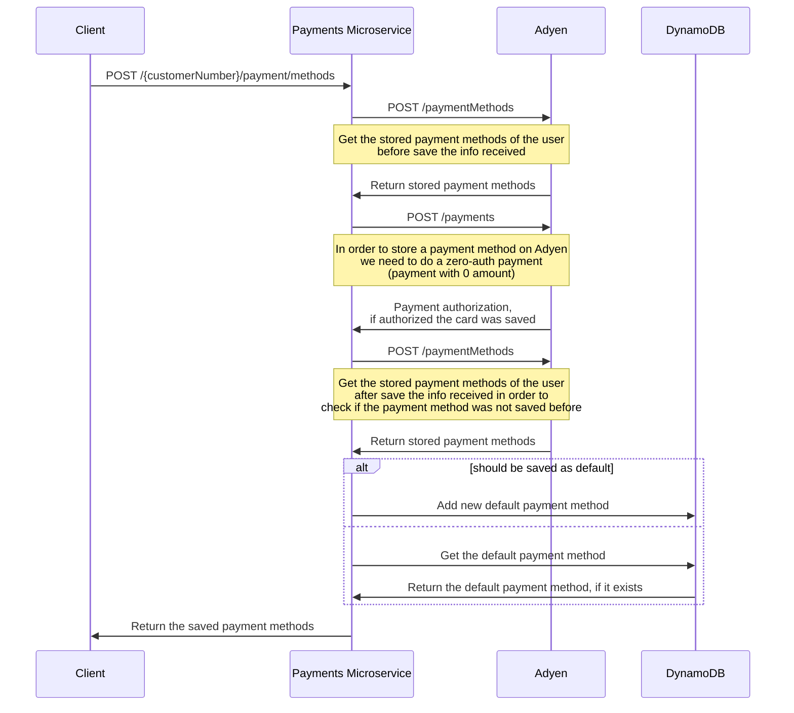
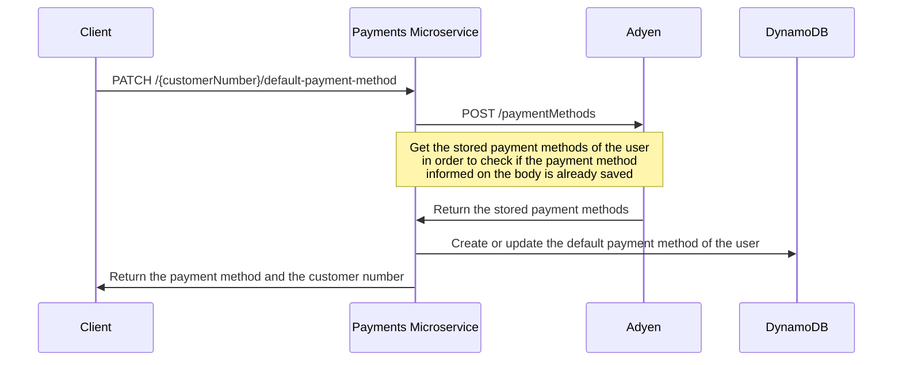
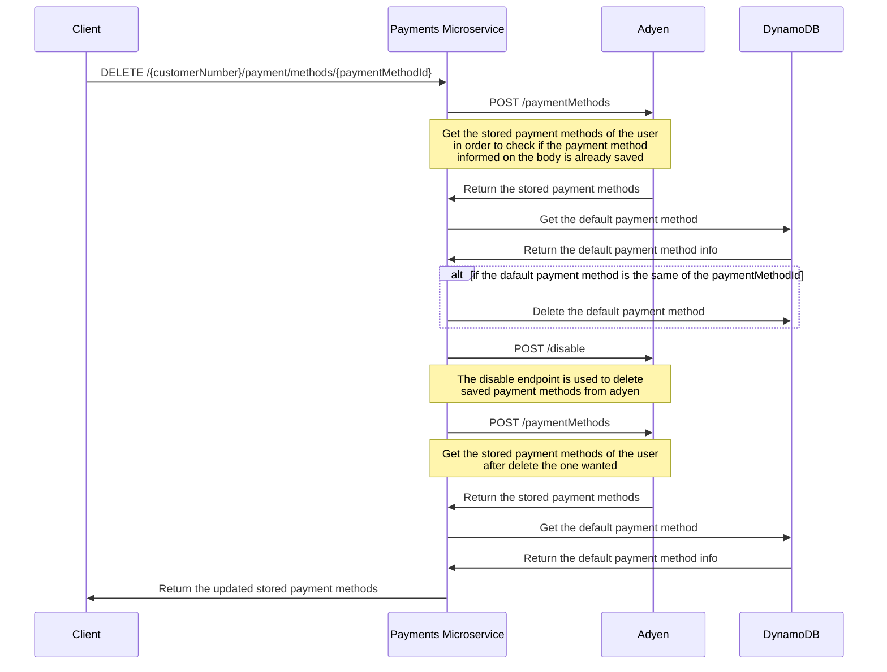

## Table of Contents

  1. [About The Project](#about-the-project)
  1. [Built With](#built-with)
  1. [Getting Started](#getting-started)
  1. [Usage](#usage)
  1. [Architecture diagram](#architecture-diagram)
  1. [Sequence diagrams](#sequence-diagrams)
  2. [Project specifics](#project-specifics)


## About The Project

Microservice responsible for ensuring the business logic around the payment flows.


## Built With

- ##### Node.js
    - It's a JavaScript runtime built on Chrome's V8 JavaScript engine.
    - Download it here: https://nodejs.org/en/
    - Installed version: v14.x.0 (or higher)
    - Documentation: https://nodejs.org/dist/latest-v14.x/docs/api/

- ##### yarn
    - It's a package manager for Node.js.
    - How to install: https://classic.yarnpkg.com/lang/en/docs/install/#debian-stable
    - Installed version: 1.22.x (or higher)

- ##### Serverless Framework
    - We use the Serverless Framework to develop, deploy and troubleshoot our lambda applications.
    - It consists of an open source CLI that provides us with full serverless application lifecycle management.
    - Install it with npm: [sudo] npm install --global serverless  
    - Other ways to install: https://www.serverless.com/framework/docs/getting-started/
    - Installed version 2.38.0 (or higher)
    - Documentation for AWS: https://www.serverless.com/framework/docs/providers/aws/

- ##### aws cli
    - It's a unified tool to manage your AWS services.
    - How to install: https://docs.aws.amazon.com/cli/latest/userguide/install-cliv2.html  
    - Installed version aws-cli/2.1.32 (or higher)
    - Documentation: https://aws.amazon.com/blogs/developer/aws-cli-v2-is-now-generally-available/

- ##### aws-vault
    - It's a tool to securely store and access AWS credentials in a development environment.
    - Install and Documentation: https://github.com/99designs/aws-vault  
    - Installed version 6.2.0 (or higher)

## Getting Started

### Deploy an environment  

In order to deploy a microservice you need to execute the following command in the directory containing the **_serverless.yml_** file:

```sh
aws-vault exec <profile> --no-session -- serverless deploy --stage <stage>
```

**<profile>** must be the credential title (the name within brackets) at **~/.aws/credentials** file.
**<stage>** must be the alias for your environment: **stg** (staging), **prd** (production) or **sbx** (sandbox).

### Automatic Deployment

Through **bitbucket-pipeline.yml** file we set a pipeline for four branches: _sandbox_, _development_, _staging_ and _master_.
After every merge for each of these branches a pipeline will be triggered and a container will run  the steps we've defined. 

In all branches the first step is to verify which files where updated and, in consequence, set the pertinent tags.
```
- step:
    name: Create new sbx Adyen tag
    script:
    - git tag adyen-sbx-${BITBUCKET_BUILD_NUMBER}
    - git push origin adyen-sbx-${BITBUCKET_BUILD_NUMBER}
    condition:
    changesets:
        includePaths:
        - "*"
        - "src/*"
        - "src/config/*"
        - "src/utils/*"
        - "src/middlewares/*"
        - "src/handlers/adyen/*"
- step:
    name: Create new sbx PayPal tag
    script:
    - git tag paypal-sbx-${BITBUCKET_BUILD_NUMBER}
    - git push origin paypal-sbx-${BITBUCKET_BUILD_NUMBER}
    condition:
    changesets:
        includePaths:
        - "*"
        - "src/*"
        - "src/config/*"
        - "src/utils/*"
        - "src/middlewares/*"
        - "src/handlers/paypal/*"
```

After that, depending on the set tags, is decided which functions are gonna be deployed
```
adyen-sbx-*:
- step:
    name: Deploy Adyen service to sandbox
    caches:
    - node
    script:
    - yarn global add serverless
    - yarn
    # Deploys all Adyen related functions
    - SLS_DEBUG=* serverless deploy -f adyenPayment --stage sbx
    - SLS_DEBUG=* serverless deploy -f adyenCallback --stage sbx
    - SLS_DEBUG=* serverless deploy -f paymentInfo --stage sbx

paypal-sbx-*:
- step:
    name: Deploy PayPal service to sandbox
    caches:
    - node
    script:
    - yarn global add serverless
    - yarn
    # Deploys all PayPal related functions
    - SLS_DEBUG=* serverless deploy -f paypalCallback --stage sbx
    - SLS_DEBUG=* serverless deploy -f checkout --stage sbx
    - SLS_DEBUG=* serverless deploy -f paypalPayment --stage sbx
```


### Environments Information

| Name  | Alias | Domain name  | Target domain | Salesforce organization | 
| ---- | --- | ---- | --- | --- |
| Development  | **dev**  | `payments-dev.company.com` | `domain`| **bdlq_dev**
| Sandbox  | **sbx**  | `payments-sbx.company.com` | `domain`| **bdlq_s07**
| Playground  | **sbx**  | `payments-play.company.com` | `domain`| **bdlq_s05**
| Staging  | **stg**  | `payments-stg.company.com` | `domain`| **bdlq_stg**
| Production  | **prd**  | `payments-prd.company.com` | `domain`| **bdlq_prd**

### Run locally

First, install the project packages

```bash
yarn install
```

Then, execute the command to emulate an AWS λ and API Gateway on the local machine

```bash
yarn run offline
```
The command above executes the following command: `SLS_DEBUG=* serverless offline start --stage sbx`. 

Under the hood, It uses **serverless-offline** pluging to try and simulate the AWS stack containng AWS Gateway and lambda functions. 

Notice that the local executing is pointing to the sandbox environment.

## Usage
    
### API Documentation

You can read a detailed documention about all the endpoints exposed by this service at: https://app.swaggerhub.com/apis/company/payment-services

Alternatively, you can read the YAML file at docs/swagger.yml


## Architecture diagram


## Sequence diagrams

The paypal payment method diagram contains the following endpoints: payment, checkout, callback


<br>
<br> 
<br>
<br> 


The adyen payment method diagram contains the following endpoints: addPaymentInfo, payment, callback



<br>
<br> 
<br>
<br>

Stored payment methods diagram



<br>
<br> 
<br>
<br>

Store payment method and set it as the default one diagram



<br>
<br> 
<br>
<br>

Update the default payment method diagram



<br>
<br> 
<br>
<br>


<br>
<br> 
<br>
<br>


## Project specifics

### Importing Rule

To make sure that we have a pattern when we're importing packages, we decided to use the following import ordering:

- 1st: Built-in packages
- 2nd: Installed packages (dependencies on package.json)
- 3rd: Local packages/modules

Here is an example of how it should look like:

```ts
// 1. core modules
import fs from "fs";
import http from "http";

// 2. public modules from npm
import express from "express";
import uuid from "node-uuid";

// 3. your own modules from file
import myMod from "./mod.js";
```

### Use of headers for configuring env vars

By default, every environment where the service is running has its own set of pre-configured env vars. To add more flexibility in terms of the external providers that the service communicating with, is possible to modify these env vars through the use of request headers.


Here follows a list of the env vars used by the service and what they are used for...

Salesforce URI and credentials
- SALESFORCE_CLIENT_ID 
- SALESFORCE_OCAPI_DOMAIN 
- SALESFORCE_OCAPI_VERSION    

Adyen URI and credentials
- ADYEN_API_KEY 
- ADYEN_URL 
- ADYEN_URL_VERSION    

Paypal URI and credentials
- PAYPAL_USERNAME 
- PAYPAL_PASSWORD 
- PAYPAL_SIGNATURE 
- PAYPAL_NVP_URL 
- PAYPAL_NVP_VERSION 
- PAYPAL_CHECKOUT_URL


As an example of use, let suppose that we want to point to a different Salesforce OCAPI instance than the one previously configured on the used environment. A POST /paypal/payment should have the following headers...

```
POST /CompanyES/paypal/payment HTTP/1.1
Host: payments-dev-v1.company.com
SALESFORCE_CLIENT_ID: *******
SALESFORCE_OCAPI_DOMAIN: *******
SALESFORCE_OCAPI_VERSION: *******
Authorization: *******
Content-Type: application/json
Content-Length: 48
{
    "basketId": "*****"
}
```

- **Regarding the use of OCAPI. If the services is configured to point to a different OCAPI instance than the environment default, the use of a token from that environment will be needed.**
- **This feature does not work on the production and staging environments.**
- **The coherent use of this feature is advised, in order for the the service to work properly.**

# How to setup Multibanco

## Multibanco diagram


## Set Adyen Webhooks

In other to send the notifications about the approval or not of the payment, it's needed to setup a webhook on Adyen pointing to the payment service. 

- To do so, you need to access the [Adyen Customer Area](https://ca-test.adyen.com/ca/ca/overview/default.shtml) and go under `Developers > Webhooks` and then click on the create webhook button (orange) 
    

- Search for `Standard notification` and click `Add`
    

- On server configuration, on the `URL` field insert the notification endpoint of the specific environment you want to add, and then click `Apply`
    

- On Merchant accounts select `CompanyES`, `CompanyPT`, `TiendanimalCOM`, `TiendanimalPT`, and the click `Apply`
    

- On Security you need to generate the HMAC Key, click `Generate` and copy the HMAC Key and then click `Apply`
    

- To finish click on the `Disabled` switch to enable the webhook and the `Save changes`
    

After that you'll need to create/update the ssm parameter with the HMAC Key `/STAGE/payments-service/adyen_hmac_key`.

## Configure OCAPI settings

It is also necessary to enable the endpoints for the trusted system authentication. For that on the BM go under `Administration >  Site Development >  Open Commerce API Settings`, for `Select Type` set `Shop` and `Select Context` set `Global`. And add the following configuration

```
{
    "_v": "21.7",
    "clients": [
        {
            "client_id": "a11d0149-687e-452e-9c94-783d489d4f72",
            "resources": [
                {
                    "resource_id": "/customers/auth",
                    "methods": ["post", "delete"],
                    "read_attributes": "(**)",
                    "write_attributes": "(**)"
                },
                {
                    "resource_id": "/customers/auth/trustedsystem",
                    "methods": ["post"],
                    "read_attributes": "(**)",
                    "write_attributes": "(**)"
                }
            ]
        }

    ]
}
```

# How to test Multibanco payments

In other to test Multibanco you should follow the following steps:

### 1 - Call POST /payment/instruments with Multibanco-specific body

For the Multibanco payment, you need to send the `paymentMethod` attribute as `multibanco`


```
POST /v1/CompanyPT/adyen/baskets/040e60d5fda80883618842f50c/payment/instrument HTTP/1.1
Host: payments-sbx.company.com
Authorization: Bearer token
Content-Type: application/json
Content-Length: 39

{
    "paymentMethod": "multibanco"
}
```

### 2 - Call the /payment endpoint

If the call to the /payment was successful you will receive something like this:

```
{
    "paymentResult": {
        "paymentMethodType": "multibanco",
        "entity": "11249",
        "expiresAt": "2022-06-27T12:07:17",
        "initialAmount": {
            "currency": "EUR",
            "value": 2928
        },
        "merchantName": "CompanyPT",
        "merchantReference": "00000019",
        "reference": "524 972 818",
        "totalAmount": {
            "currency": "EUR",
            "value": 2928
        },
        "type": "voucher"
    },
    "order": {
        "_v": "20.10",
        "_type": "order",
    ...
    }
}
```

The `reference` field is the one that will be presented to the users so they can make the payment.

### 3 - Simulate the user payment

Multibanco payments are not approved automatically as Credit Card payments, to simulate the approval you need to go to the [Customer Area](https://ca-test.adyen.com/ca/ca/overview/default.shtml) of Adyen and follow these steps:

- On the home page click on the `Transactions` sessions and then `Offers` to go to the offers page
  

- On the Offers page, locate the order you want to approve by checking the `Account` column that represents the site id, and the `Merchant Reference` (red) that represents the order number. Once you locate your offer, click on the `PSP Reference` (orange)
  

- On the Offer page, click on `Promote offer to sale` and then confirm the action
    
    

- After that, wait a few minutes while Adyen sends the notification of the approval to this microservice, and so it'll process the notification and change the statuses of the salesforce order.
    
